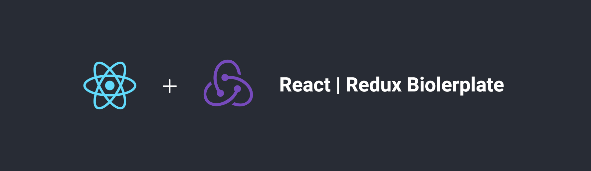

## React With Redux Boilerplate

This repository will help tp start ReactJS app with the help of redux state managment.

### Features

### Redux

Unidirectional data flow allows for change logging and time travel debugging.

### ES6

Use template strings, object destructuring, arrow functions, JSX syntax and more, today.

### SASS

Write composable CSS that's co-located with your components for complete modularity.

### React Reach Router

It's natural to want to add pages (e.g. `/`) to your application, and routing makes this possible.

### React Bootstrap

Built with compatibility in mind, we embrace our bootstrap core and strive to be compatible with the world's largest UI ecosystem

### How to Start

- Clone the repo https://github.com/sahalea/hello-react.git

```
npm install
npm start
Navigate to http://localhost:3000
```
